# บัญชีเป้าหมายไซเบอร์เชิงยุทธศาสตร์และยุทธวิธีของฝ่าย Woadland (Woadland Cyber Target List)
## จัดเตรียมโดย: ฝ่ายปฏิบัติการสงครามไซเบอร์ กองทัพเรือ Alizaria (AZ Cyber Command - AZCC)

เอกสารฉบับนี้เป็นข้อมูลวิเคราะห์การข่าวกรองทางไซเบอร์ (Cyber Intelligence) เพื่อชี้เป้าโครงสร้างพื้นฐานระบบดิจิทัล เครือข่าย และระบบควบคุมอัตโนมัติของฝ่าย Woadland ที่ฝ่ายปฏิบัติการไซเบอร์ของ Alizaria สามารถเข้าแทรกซึม โจมตี ขัดขวาง หรือดักรับข้อมูล เพื่อสนับสนุนการยุทธร่วมและตัดการควบคุมบังคับบัญชา (C2) ของข้าศึก

---

## ๑. วัตถุประสงค์ยุทธศาสตร์ไซเบอร์ (Cyber Strategic Objectives)
1. **การตัดขาดการบังคับบัญชา (C2 Disruption):** ตัดช่องทางการสื่อสารดิจิทัลระหว่างศูนย์บัญชาการแผ่นดินใหญ่ Woadland กับหน่วยกำลังรบส่วนหน้าบนเกาะ Talos และเกาะ Sosnovka
2. **การลวงและดักรับข้อมูลข่าวสาร (Espionage & Information Operations):** เข้าถึงระบบควบคุมเครือข่ายใยแก้วนำแสงเพื่อดักฟังข้อมูลการส่งคำสั่งยุทธการ (Tapping) และสกัดแผนการเคลื่อนกำลังพลของข้าศึก
3. **การทำให้ระบบป้องกันภัยตาบอด (Air Defense / Maritime Blindness):** โจมตีขัดขวางสายข้อมูลเรดาร์ (Data Links) เพื่อลดขีดความสามารถการประสานงานระบบป้องกันภัยทางอากาศและระบบควบคุมการเดินเรือ

---

## ๒. ตารางบัญชีเป้าหมายไซเบอร์ (Cyber Target Matrix)

| หมายเลขเป้าหมาย (TG-ID) | ชื่อเป้าหมาย / ระบบเครือข่าย (System Name) | เครือข่ายที่เกี่ยวข้อง (Associated Network) | ขีดความสามารถยุทธการ (Operational Value) | จุดล่อแหลมทางไซเบอร์ (Cyber Vulnerabilities) | หนทางโจมตีทางไซเบอร์ (Cyber Attack Vectors) | ผลกระทบที่คาดหวัง (Expected Impact) |
| :--- | :--- | :--- | :--- | :--- | :--- | :--- |
| **TG-WL-CYB-001** | ระบบบริหารจัดการเครือข่ายดาวเทียม ATsT | ATsT Military SATCOM Gateway | ช่องทางสั่งการหลักผ่านดาวเทียมเข้ารหัสของกองทัพ Woadland | พึ่งพาซอฟต์แวร์การบริหารจัดการเชิงพาณิชย์ (ATsT Billing & Allocation) | โจมตีห่วงโซ่อุปทาน (Supply Chain Attack) หรือแฮกเข้าสู่พอร์ทัลจัดสรรสัญญาณทหาร | ตัดขาดช่องสัญญาณดาวเทียมสำรองของกองเรือข้าศึกในทันที |
| **TG-WL-CYB-002** | ระบบบริหารจัดการโครงข่ายใต้น้ำ TOA NMS | TOA Undersea Fiber-Optic Link | ควบคุมการใช้สายเคเบิลใต้น้ำจากเมือง Menton ไปยัง Torres (เกาะ Talos) | พอร์ต Remote Maintenance ของบริษัท TOA เชื่อมต่ออินเทอร์เน็ตเพื่อรับบริการทางเทคนิค | เจาะระบบเครือข่ายภายในของ TOA ผ่านการทำ Phishing พนักงาน และแทรกซึมเข้าระบบ NMS | สั่ง Shutdown ตัวแปลงสัญญาณแสง (Optical Transponders) ตัดการสื่อสารความเร็วสูงข้ามเกาะ |
| **TG-WL-CYB-003** | ระบบควบคุมศูนย์ชุมสายโทรคมนาคมใต้ดิน Talos | Talos Core Router Grid | ระบบสลับเส้นทางข้อมูล (Routing) หลักระหว่างเมืองหลวง Yasnaya กับเมือง Pochinki | ใช้โปรโตคอลการจัดการเครือข่ายภายในที่ไม่มีการเข้ารหัสความมั่นคงสูง (Legacy SNMP/Telnet) | เจาะผ่านจุดเชื่อมต่อ Wi-Fi ทหารบริเวณรอบศูนย์ หรือการใช้มัลแวร์ฝังตัวภายใน (Insider USB) | บิดเบือนตารางเส้นทางข้อมูล (Route Poisoning) ทำให้ระบบการส่งข้อมูลทหารล่ม |
| **TG-WL-CYB-004** | ระบบวิทยุซอฟต์แวร์ (SDR) ควบคุมเสาไมโครเวฟ Stalber | Stalber Microwave Remote Controller | ทวนสัญญาณสื่อสารของกองทัพเรือและกองทัพบก Woadland ทั่วแนวเทือกเขา | ซอฟต์แวร์ควบคุมเสาสัญญาณระยะไกลเชื่อมต่อระบบเครือข่ายไร้สายยุทธวิธีเพื่อปรับทิศจาน | เจาะระบบปรับแต่งระยะไกลผ่านการใช้ช่องโหว่ความมั่นคงรหัสผ่านระบบควบคุมอุตสาหกรรม (SCADA/ICS) | สั่งเบี่ยงเบนทิศทางจานไมโครเวฟ ส่งผลให้สัญญาณการสื่อสารหลุดจากการจัดแนวแนวสายตา |
| **TG-WL-CYB-005** | เครือข่ายส่งข้อมูลระบบเตือนภัยทางอากาศและเรดาร์ W6 | W6 Air Defense Data-Link (AD-Link) | ลิงก์เชื่อมต่อเรดาร์ตรวจการณ์ Sosnovka ไปยังศูนย์บัญชาการป้องกันทางอากาศหลัก | ช่องโหว่ของโปรโตคอลเครือข่ายการแลกเปลี่ยนข้อมูลยุทธวิธี (Data-link telemetry validation) | โจมตีโดยการปลอมแปลงโหนดเชื่อมต่อทางทหาร (Man-in-the-Middle) หรือฝังซอฟต์แวร์เจาะระบบ | ทำการบิดเบือนข้อมูลพิกัดอากาศยาน (Target Spoofing) หรือสร้างเป้าลวงบนจอเรดาร์ |
| **TG-WL-CYB-006** | ระบบฐานข้อมูลและควบคุมสถานี HF ชายฝั่ง Georgopol | Georgopol Maritime Comm Terminal | ควบคุมการจราจรทางเรือรบ/เรือสินค้า และส่งสัญญาณคำสั่งทางทะเลฝั่งตะวันตก | ระบบคอมพิวเตอร์ควบคุมข่ายความถี่วิทยุชายฝั่งเชื่อมต่อกับฐานข้อมูลท่าเรือพลเรือน | เจาะผ่านช่องโหว่เว็บแอปพลิเคชันบริหารท่าเรือ และทำการกระโดดข้ามเครือข่าย (VLAN Hopping) สู่ข่ายทหาร | แย่งชิงสิทธิ์การควบคุมเครื่องส่งวิทยุ สั่งระงับการออกอากาศ หรือส่งพิกัดปลอมแก่เรือในทะเล |

---

## ๓. รายละเอียดเป้าหมายไซเบอร์สำคัญและการวิเคราะห์ทางเทคนิค (Target Profiles)

### TG-WL-CYB-001: ระบบบริหารจัดการเครือข่ายดาวเทียม ATsT
* **ลักษณะทางกายภาพที่เกี่ยวข้อง:** สถานีรับ-ส่งดาวเทียมสนามบิน Sosnovka (**TG-WL-COM-001**)
* **วิเคราะห์จุดล่อแหลม:** กองทัพ Woadland เช่าช่องสัญญาณดาวเทียมพาณิชย์ของบริษัท ATsT มาปรับใช้ในภารกิจทหาร โดยระบบควบคุมวงโคจรและการจัดสรรแบนด์วิดท์บริหารผ่านโครงสร้างพื้นฐานไอทีของ ATsT บนแผ่นดินใหญ่
* **แนวทางการยุทธทางไซเบอร์ (Cyber Vector):**
  > [!IMPORTANT]
  > การโจมตีทางไซเบอร์จะมุ่งเป้าไปที่ **ATsT Command and Control Link** โดยฝ่ายไซเบอร์ AZ จะใช้ปฏิบัติการเจาะระบบเครือข่ายไอทีของ ATsT (เช่น การแฮกผ่านผู้ให้บริการซัพพลายเออร์ที่ดูแลระบบจานรับสัญญาณ) เพื่อเข้าถึงคอนโซลบริหารช่องสัญญาณผ่านดาวเทียม จากนั้นส่งรหัสคำสั่งระดับผู้ดูแลระบบเพื่อแก้ไขการจัดสรรช่องความถี่ทหารเรือข้าศึก หรือเขียนทับเฟิร์มแวร์ของโมเด็มรับสัญญาณดาวเทียมที่ติดตั้งใน Sosnovka เพื่อล็อกระบบไม่ให้สามารถใช้งานได้ (Modem Brick)
* **ผลลัพธ์ทางยุทธการ:** ตัดขาดสัญญาณดาวเทียมช่องทางส่งผ่านข้อมูลยุทธการที่ปลอดภัยที่สุด ส่งผลให้ข้าศึกต้องถอยไปใช้ช่องทางวิทยุ HF ซึ่งดักฟังและกวนสัญญาณได้ง่าย

---

### TG-WL-CYB-002: ระบบบริหารจัดการโครงข่ายใต้น้ำ TOA NMS
* **ลักษณะทางกายภาพที่เกี่ยวข้อง:** จุดขึ้นฝั่งสายเคเบิลใต้น้ำ Torres (**TG-WL-COM-005**)
* **วิเคราะห์จุดล่อแหลม:** บริษัท TOA บริหารช่องสัญญาณสายเคเบิลใต้น้ำ Torres โดยใช้ระบบ Network Management System (NMS) ซึ่งมีพอร์ตบริการระยะไกลเพื่อให้นักพัฒนาจากต่างประเทศเข้ามาดูแลระบบผ่าน VPN
* **แนวทางการยุทธทางไซเบอร์ (Cyber Vector):**
  > [!WARNING]
  > เข้ายึดพอร์ต VPN หรือขโมยรหัสผ่านเข้าถึงของผู้ให้บริการระยะไกล (Credential Stuffing/Phishing) เพื่อแฝงตัวเข้าไปในเครือข่าย NMS ของ TOA จากนั้นดำเนินการควบคุมอุปกรณ์ Optical Line Terminal (OLT) และปรับเปลี่ยนการตั้งค่าโครงสร้างความยาวคลื่นแสง (Wavelength Configuration) เพื่อระงับสัญญาณ (Optical Disruption) หรือสร้างการแจ้งเตือนสัญญาณขาดลวง ส่งผลให้ระบบสลับเส้นทางขัดข้อง
* **ผลลัพธ์ทางยุทธการ:** ตัดขาดสายเคเบิลใยแก้วใต้ทะเลความเร็วสูงซึ่งเป็นช่องสัญญาณอินเทอร์เน็ตและเครือข่ายโทรศัพท์หลักระหว่างแผ่นดินใหญ่ Woadland และเกาะ Talos ทันที

---

### TG-WL-CYB-003: ระบบควบคุมศูนย์ชุมสายโทรคมนาคมใต้ดิน Talos
* **ลักษณะทางกายภาพที่เกี่ยวข้อง:** ศูนย์ชุมสายโทรคมนาคมใต้ดินเกาะ Talos (**TG-WL-COM-002**)
* **วิเคราะห์จุดล่อแหลม:** ระบบเราเตอร์และอุปกรณ์สลับสัญญาณภายในอุโมงค์ใช้โปรโตคอลแบบเก่าในการแลกเปลี่ยนข้อมูล เช่น BGP ภายในแบบไม่มีการยืนยันตัวตนที่รัดกุมพอ และมีการเชื่อมต่อกับสถานีเสาสัญญาณภายนอกเพื่อเชื่อมสัญญาณทหาร
* **แนวทางการยุทธทางไซเบอร์ (Cyber Vector):**
  > [!TIP]
  > ดำเนินการแทรกซึมทางไซเบอร์เข้าสู่เราเตอร์ชายขอบ (Edge Routers) ผ่านทางเสาสัญญาณวิทยุชุมชนรอบเกาะที่เป็นระบบเชื่อมต่อไร้สาย จากนั้นทำการโจมตีด้วยวิธี **Route Poisoning** หรือแก้ค่าสวิตช์เราติ้งเพื่อนำส่งทราฟฟิกข้อมูลยุทธการทหารข้าศึกทั้งหมดส่งผ่านมายังเครื่องดักฟังของฝ่ายเรา (Man-in-the-Middle) ก่อนส่งต่อไปยังปลายทาง เพื่อไม่ให้ข้าศึกรู้ตัวว่าถูกดักฟังข้อมูลลับ
* **ผลลัพธ์ทางยุทธการ:** สามารถควบคุมและถอดรหัสลับข้อมูลการวางแผนยุทธการ ข่าวสารการรบ และคำสั่งสั่งการส่งถึงกองกำลังข้าศึกบนเกาะ Talos ได้ทั้งหมด

---

### TG-WL-CYB-005: เครือข่ายส่งข้อมูลระบบเตือนภัยทางอากาศและเรดาร์ W6
* **ลักษณะทางกายภาพที่เกี่ยวข้อง:** ศูนย์ควบคุมและอำนวยการยุทธทางอากาศ W6 (**TG-WL-COM-009 / W6**)
* **วิเคราะห์จุดล่อแหลม:** ข้อมูลเรดาร์ตรวจการณ์ทางอากาศจาก Sosnovka จะถูกบีบอัดและส่งต่อผ่านข่ายข้อมูลยุทธวิธี (Tactical Data Link) เพื่อไปแสดงผลทางยุทธวิธีที่ศูนย์ W6 หากข้าศึกเปลี่ยนรูปแบบรหัสความมั่นคงช้า จะล่อแหลมต่อการส่งข้อมูลปลอมเข้าไปในข่าย
* **แนวทางการยุทธทางไซเบอร์ (Cyber Vector):**
  > [!CAUTION]
  > ฝ่ายไซเบอร์ AZ จะดำเนินการโจมตีไซเบอร์แบบก้าวหน้าโดยการแฮกเข้าสู่สถานีทวนสัญญาณไมโครเวฟกลางเกาะ เพื่อเข้าถึงโปรโตคอลการแลกเปลี่ยนข้อมูลยุทธวิธี และใช้มัลแวร์ประเภท Packet Injection เพื่อส่งพิกัดอากาศยานลวง (Ghost Targets) เข้าสู่สายข้อมูลเตือนภัย หรือปิดกั้นสัญญาณเป้าจริง (Target Suppression) ของอากาศยานรบฝ่าย Alizaria
* **ผลลัพธ์ทางยุทธการ:** ข้าศึกจะไม่สามารถมองเห็นอากาศยานรบจริงของฝ่ายเรา หรือสับสนจากการเห็นเป้าหมายลวงจำนวนมาก ส่งผลให้ระบบป้องกันภัยทางอากาศข้าศึกเป็นอัมพาตชั่วคราว เปิดโอกาสให้ฝ่ายเราโจมตีทางอากาศได้อย่างปลอดภัย

---

## ๔. แผนปฏิบัติการโจมตีประสานทางไซเบอร์ (Coordinated Cyber Strike Plan - Operation "Silent Horizon")

เพื่อให้การปฏิบัติการมีประสิทธิภาพสูงสุดในการยึดครองเกาะ Talos ฝ่ายสงครามไซเบอร์ AZ จะผสานแผนการโจมตีร่วมกับกำลังหลักดังนี้:

```mermaid
sequenceDiagram
    autonumber
    participant CyberCommand as ฝ่ายไซเบอร์ Alizaria (AZCC)
    participant CableTorres as ใยแก้ว Torres NMS (TG-WL-CYB-002)
    participant SatSosnovka as ดาวเทียม Sosnovka (TG-WL-CYB-001)
    participant RadarW6 as ระบบเรดาร์และดาต้าลิงก์ W6 (TG-WL-CYB-005)
    participant FleetForce as กองกำลังทางเรือ/อากาศ AZ
    
    rect rgb(20, 30, 50)
        Note over CyberCommand, RadarW6: ขั้นที่ 1: ขั้นเตรียมการ (Stealth Access & Implant)
        CyberCommand->>CableTorres: ฝังมัลแวร์/เตรียมคำสั่งรีบูตระบบแสง (Stealth Implant)
        CyberCommand->>SatSosnovka: แฮกพอร์ต ATsT เพื่อจำลองการตัดสัญญาณดาวเทียม
    end

    rect rgb(30, 45, 75)
        Note over CyberCommand, FleetForce: ขั้นที่ 2: ขั้นโจมตี (Coordinated Strike - H-Hour)
        CyberCommand->>CableTorres: ส่งคำสั่งรีบูตพอร์ต OLT (Shut Down การเชื่อมโยงสายใยแก้วความเร็วสูง)
        CyberCommand->>SatSosnovka: บล็อกช่องสัญญาณดาวเทียมทหาร (ตัด C2 ยุทธศาสตร์ข้าศึก)
        Note over CableTorres, SatSosnovka: เกาะ Talos ถูกตัดขาดจากแผ่นดินใหญ่
    end

    rect rgb(50, 20, 20)
        Note over CyberCommand, FleetForce: ขั้นที่ 3: ปลุกระบบลวงภัยทางอากาศ (Air Blindness)
        CyberCommand->>RadarW6: ส่งสัญญาณเป้าหมายลวง (Inject Ghost Targets) บนจอเรดาร์ W6
        FleetForce->>FleetForce: ส่งเครื่องบินรบและกำลังพลทางอากาศเข้าสู่เขต Talos
        RadarW6-->>FleetForce: ข้าศึกสับสนไม่สามารถยืนยันตำแหน่งฝูงบินจริงได้
    end
```

---

> [!NOTE]
> **ข้อเสนอแนะฝ่ายเสนาธิการ (Operational Staff Notes):**
> การโจมตีทางไซเบอร์เป็นอาวุธชนิดไม่เปิดเผยตัวตน (Non-kinetic Weapon) ที่มีอำนาจการทำลายชั่วคราวแต่ฉับพลัน แนะนำให้เริ่มปฏิบัติการสงครามไซเบอร์ **ก่อนการยิงเปิดหน้าศึกเชิงกายภาพ (Kinetic Strike) ประมาณ ๑๕ - ๓๐ นาที** เพื่อสร้างความสับสนอลหม่านและความล้มเหลวในการส่งข้อมูลข่าวสารของข้าศึก ทำให้ไม่สามารถสั่งยิงปืนใหญ่ตอบโต้หรือสั่งกำลังป้องกันภัยทางอากาศมาปะทะกับฝูงบินและกองเรือฝ่าย Alizaria ได้ทันท่วงที
